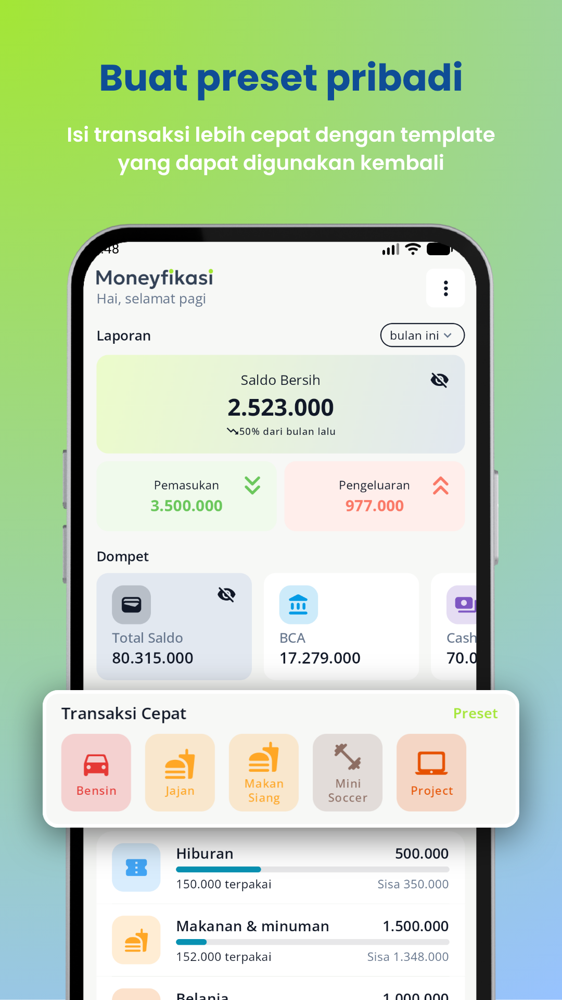
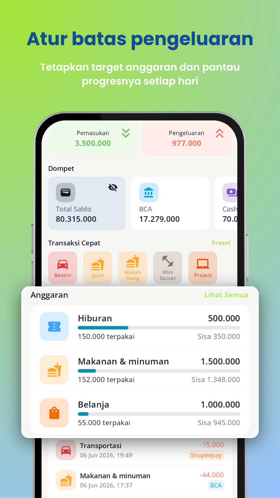
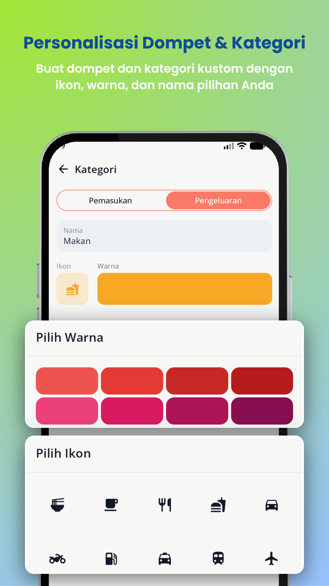
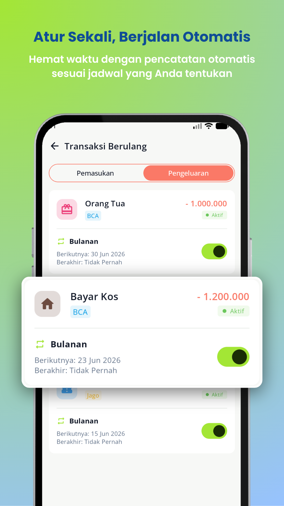
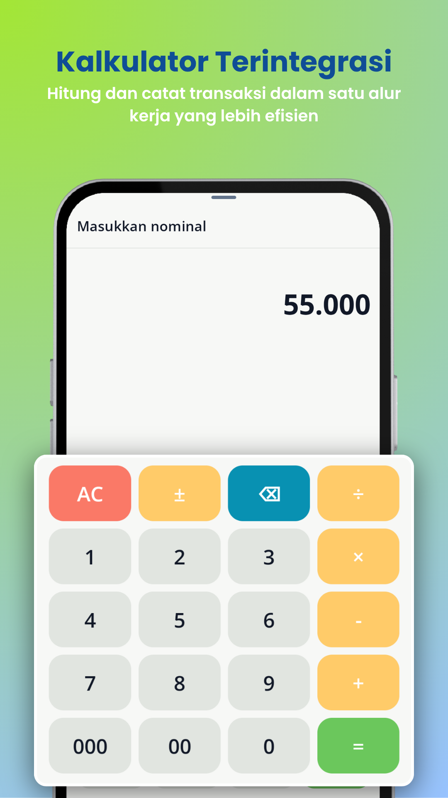
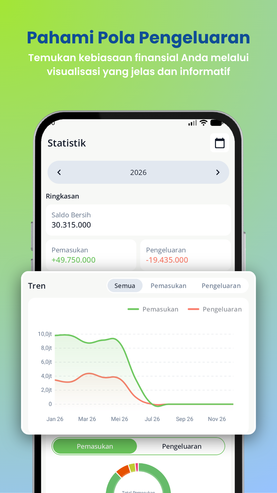
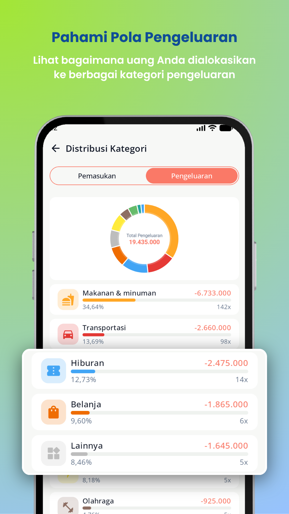
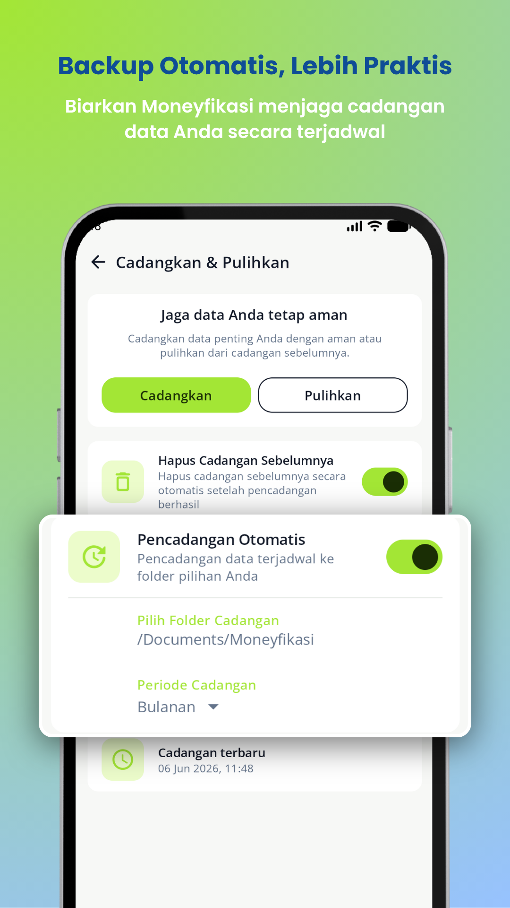

<h1 align="center" style="font-size:28px; line-height:1"><b>Moneyfikasi</b></h1>

  

  Moneyfikasi is a simple yet powerful tool designed to help you manage your personal or small business finances more effectively. The app allows you to record all financial transactions, categorize expenses and income, and analyze your financial habits through various reports and graphs.

## Screenshots

|                     |                      |                      |                      |
----------------------|----------------------|----------------------|----------------------|
     |     |     |     |
     |     |     |     |

## Key Features

- **Recording Transactions.** Easily record income, expenses, and transfers between wallets.
- **AI Smart Input.** Quickly add transactions by typing natural language sentences, powered by AI.
- **Financial Reports.** Detailed summaries of your financial activities over custom time periods.
- **Analysis Graphs.** Visualize your spending and income trends with interactive charts.
- **Multiple Wallets.** Manage different accounts or cash sources in one place.
- **Customizable Categories.** Organize transactions with custom names, icons, and colors.
- **Budgeting.** Set and track budgets for different categories to control your spending.
- **Recurring Transactions.** Automate regular payments and income tracking.
- **Backup & Restore.** Securely backup your data locally and restore it whenever needed.
- **Export Data.** Export your financial records to CSV or XLSX formats.
- **App Lock.** Protect your data with biometric authentication or a PIN.

## Tech Stack

- **Programming Language**: [Kotlin](https://kotlinlang.org/)
- **User Interface**: [Jetpack Compose](https://developer.android.com/jackpack/compose), Material Design 3
- **Architecture Pattern**: Multi-module, Clean Architecture, MVI (Model-View-Intent)
- **Dependency Injection**: [Dagger Hilt](https://dagger.dev/hilt/)
- **Networking**: [Retrofit](https://square.github.io/retrofit/) & [OkHttp](https://square.github.io/okhttp/)
- **AI Integration**: [Groq AI](https://groq.com/) & [Google Generative AI](https://ai.google.dev/)
- **Asynchronous Programming**: Kotlin Coroutines & Flow
- **Local Data Storage**: [Room Database](https://developer.android.com/training/data-storage/room), DataStore
- **Pagination**: [Android Paging](https://developer.android.com/topic/libraries/architecture/paging/v3-paged-data)
- **Charts**: [MPAndroidChart](https://github.com/PhilJay/MPAndroidChart)
- **IDE**: Android Studio
- **Dependency Management**: Gradle Version Catalog (libs.versions.toml)
- **CI/CD**: CircleCI

## Project Structure

The project follows a modularized Clean Architecture pattern to ensure scalability and maintainability:

- **`:app`**: The main entry point of the application.
- **`:feature`**: Contains various feature-based modules:
    - `home`, `wallet`, `transaction`, `category`, `budget`, `statistic`, `search`, `export`, `backupRestore`, `applock`, `settings`, `recurringTransaction`, `notification`, `about`, `splash`, `more`, `preset`.
- **`:shared`**: Contains shared components used across features:
    - **`:domain`**: Business logic, use cases, and repository interfaces.
    - **`:data`**: Repository implementations and local data sources (Room/DataStore/Remote).
    - **`:resource`**: Shared resources like strings, drawables, and themes.
    - **`:common-ui`**: Shared UI components and theme definitions.
    - **`:navigation`**: Centralized navigation logic.
    - **`:utils`**: General utility functions and extensions.

## Getting Started

To get started with Moneyfikasi, follow these steps:

1. Clone this repository to your local machine:
   `git clone https://github.com/fatkhurhmn/moneyfikasi.git`
2. Open the project in Android Studio.
3. Build and run the app on an Android device or emulator.

## How to Contribute

Contributions to Moneyfikasi are welcome! To contribute to the project, follow these steps:

1. Fork this repository.
2. Create a new branch for your feature or bug fix: `git checkout -b feature-name`.
3. Make your changes and commit them: `git commit -m 'Add new feature'`.
4. Push to the branch: `git push origin feature-name`.
5. Submit a pull request to the `develop` branch of the original repository.
