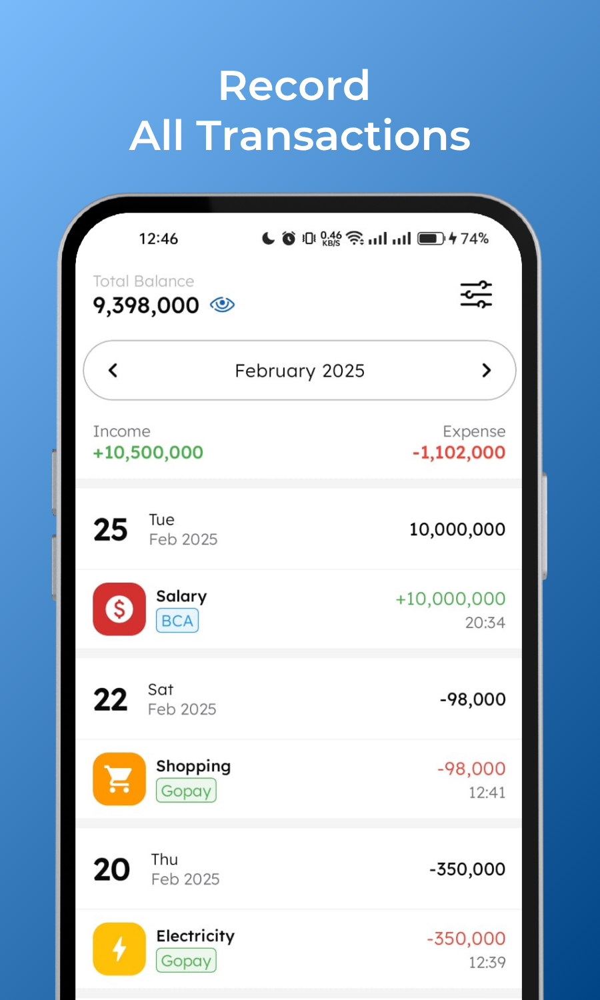
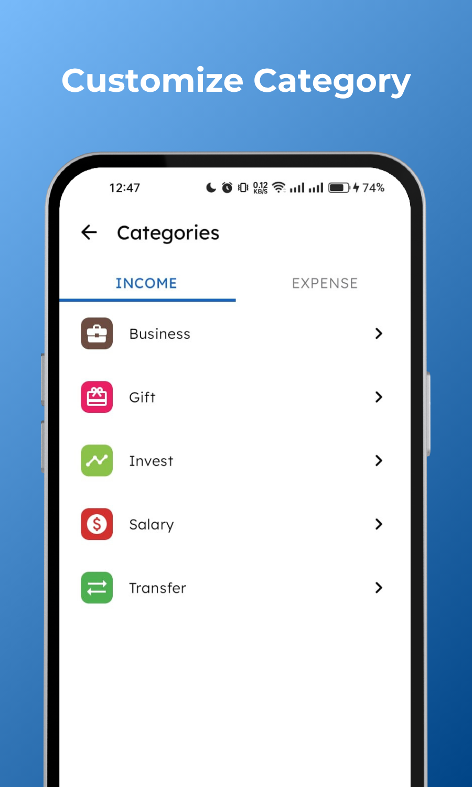

<h1 align="center" style="font-size:28px; line-height:1"><b>Moneyfikasi</b></h1>

  

  Moneyfikasi is a simple yet powerful tool designed to help you manage your personal or small business finances more effectively. The app allows you to record all financial transactions, categorize expenses and income, and analyze your financial habits through various reports and graphs.

## Screenshots
|                      |                      |                      |                      |
|----------------------|----------------------|----------------------|----------------------|
|  |  |  |  |

## Key Features

- **Recording Transactions.** Easily record all your financial transactions, both income and expenses.
- **Financial Report.** Access financial reports according to the time period you want to see a summary of your expenses and income.
- **Analysis Graph.** View graphs that show your financial trends, helping you understand spending and income patterns.
- **Multiple Wallet.** Manage finances from multiple wallets.
- **Customize Category.** Organize your transactions in various customizable categories, such as food, transportation, entertainment, etc.
- **Backup Restore.** You can backup and restore at anytime to save your record.

## Tech Stack

- **Programming Language**: Kotlin
- **User Interface**: Jetpack Compose, Material Design 3
- **Architecture Pattern**: MVI (Model-View-Intent)
- **Dependency Injection**: Dagger Hilt
- **Asynchronous Programming**: Kotlin Coroutines
- **Local Data Storage**: Room Database, Data Store
- **IDE**: Android Studio Jellyfish
- **Dependency Management**: Version Catalog
- **CI/CD**: CircleCi

## Getting Started

To get started with Moneyfikasi, follow these steps:

1. Clone this repository to your local machine using `git clone https://github.com/fatkhurhmn/moneyfikasi.git`
2. Open the project in Android Studio.
3. Build and run the app on an Android device or emulator.

## How to Contribute

Contributions to Moneyfikasi are welcome! To contribute to the project, follow these steps:

1. Fork this repository.
2. Create a new branch for your feature or bug fix: `git checkout -b feature-name`.
3. Make your changes and commit them: `git commit -m 'Add new feature'`.
4. Push to the branch: `git push origin feature-name`.
5. Submit a pull request to the `develop` branch of the original repository.
